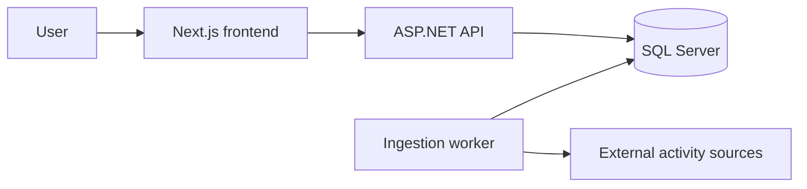

# Barnaktiv

Barnaktiv samlar barnaktiviteter i Göteborg och närområdet så att föräldrar kan hitta prova-på-pass, kurser, lovaktiviteter och föreningsaktiviteter på ett ställe.

## Tech Stack

- Frontend: Next.js 16, React 19, TypeScript, Tailwind CSS
- Backend: ASP.NET Core Web API på .NET 9
- Worker: .NET Worker Service för schemalagd datainsamling
- Data: SQL Server via Entity Framework Core migrations
- Ingestion: web scraping från konfigurerade aktivitetskällor

## Architecture

Backend följer Clean Architecture:

- `backend/Barnaktiv.Domain`: entiteter och domänregler
- `backend/Barnaktiv.Application`: use cases, DTOs, interfaces och applikationslogik
- `backend/Barnaktiv.Infrastructure`: EF Core, repositories och scrapers
- `backend/Barnaktiv.API`: HTTP API och composition root
- `backend/Barnaktiv.Worker`: schemalagd ingestion
- `frontend/web`: publik Next.js-webb



## Local Setup

Backend:

```powershell
dotnet restore Barnaktiv.sln
dotnet test Barnaktiv.sln
dotnet run --project backend/Barnaktiv.API
```

Frontend:

```powershell
cd frontend/web
npm ci
npm run dev
```

Start all local services, including automatic ingestion:

```powershell
.\scripts\start-dev.ps1
```

The frontend reads activities from `BARNAKTIV_API_BASE_URL`. For local development it defaults to `http://localhost:5289`.

## Configuration

Production secrets must be provided by the hosting environment, not committed in `appsettings.json`.

Backend examples are in `backend/.env.example`:

- `ConnectionStrings__DefaultConnection`
- `AdminApiKey__ApiKey`
- `AdminApiKey__HeaderName`
- `Cors__AllowedOrigins__0`

Frontend examples are in `frontend/web/.env.example`:

- `BARNAKTIV_API_BASE_URL`

For local .NET development, prefer user secrets or environment variables when your SQL Server differs from the default development connection string.

## Database

Apply migrations before starting the API or worker against a new database:

```powershell
dotnet ef database update --project backend/Barnaktiv.Infrastructure --startup-project backend/Barnaktiv.API
```

## Ingestion

The worker keeps data fresh automatically. It runs once on startup and then on the configured interval:

```powershell
dotnet run --project backend/Barnaktiv.Worker
```

Do not scrape external sources on every user page view. Users should get a fast response from the API/database, while the worker refreshes the database in the background.

Admins can also trigger ingestion through the API:

```powershell
Invoke-RestMethod `
  -Method Post `
  -Uri http://localhost:5289/api/admin/ingestion/run `
  -Headers @{ "X-Barnaktiv-Admin-Key" = "dev-admin-key-change-me" }
```

## Release Checks

Run these before every launch or deploy:

```powershell
dotnet test Barnaktiv.sln
cd frontend/web
npm run lint
npm run build
```

GitHub Actions also runs these checks through `.github/workflows/ci.yml`.
