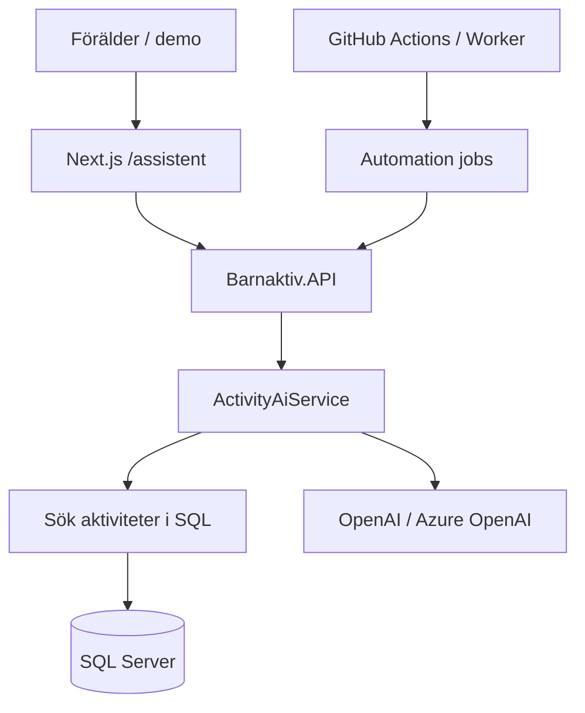

# AI-assistent (Barnaktiv)

Plan och arkitektur för AI-funktioner i Barnaktiv: assistent, RAG, agent och automation. Målet är en produktionsklar demo som visar samma mönster som en AI Product Engineer-roll (LLM + API + SQL + drift), utan att flytta hosting till Azure.

## Översikt



| Fas | Innehåll | Status |
|-----|----------|--------|
| 0 | Konfiguration, secrets, denna dokumentation | Klar |
| 1 | AI-assistent: naturligt språk → filter → LLM-svar med källor | Klar |
| 2 | RAG: embeddings + semantisk sökning | Planerad |
| 3 | Agent: verktygsloop (sök, detalj, jämför) | Planerad |
| 4 | Automation: veckosammanfattning, kvalitetsflaggor | Planerad |
| 5 | Observability, kostnad, polish för portfolio | Planerad |

## Konfiguration

Alla AI-inställningar ligger under konfigurationssektionen `Ai` (miljövariabler med prefix `Ai__`).

| Nyckel | Beskrivning | Standard |
|--------|-------------|----------|
| `Ai__Enabled` | Slår på AI-endpoints | `false` |
| `Ai__Provider` | `OpenAI` eller `AzureOpenAI` | `OpenAI` |
| `Ai__ApiKey` | API-nyckel (hemlighet) | tom |
| `Ai__Endpoint` | Azure OpenAI-resurs-URL | valfri |
| `Ai__ChatModel` | Chat-modell | `gpt-4o-mini` |
| `Ai__EmbeddingModel` | Embeddings (fas 2) | `text-embedding-3-small` |
| `Ai__MaxRequestsPerMinute` | Rate limit per IP (fas 1) | `10` |
| `Ai__MaxQuestionLength` | Max tecken i fråga | `500` |

**Aldrig** committa API-nycklar. Använd `backend/.env.example` som mall och sätt värden i:

- **Lokalt:** [User Secrets](https://learn.microsoft.com/en-us/aspnet/core/security/app-secrets) eller miljövariabler
- **MonsterASP:** kontrollpanel → miljövariabler (samma mönster som `AdminApiKey__ApiKey`)
- **GitHub Actions:** repository secrets (endast för framtida admin/automation-jobb)

### Lokalt (User Secrets)

Från `backend/Barnaktiv.API`:

```powershell
dotnet user-secrets init
dotnet user-secrets set "Ai:Enabled" "true"
dotnet user-secrets set "Ai:Provider" "OpenAI"
dotnet user-secrets set "Ai:ApiKey" "<din-openai-nyckel>"
dotnet user-secrets set "Ai:ChatModel" "gpt-4o-mini"
```

Alternativt i `appsettings.Development.json` (filen ska inte innehålla riktiga nycklar om den committas — User Secrets är säkrare).

### Produktion (MonsterASP)

Lägg till när fas 1 ska live (kan lämnas av tills dess):

```text
Ai__Enabled=true
Ai__Provider=OpenAI
Ai__ApiKey=<long-random-openai-key>
Ai__ChatModel=gpt-4o-mini
Ai__MaxRequestsPerMinute=10
```

Om `Ai__Enabled` är `true` men `Ai__ApiKey` saknas startar inte API:t (validering vid uppstart).

Om `Ai__Enabled` är `false` returnerar AI-endpoints **503** med tydligt meddelande (implementeras i fas 1).

## Säkerhet

- **Ingen PII** i prompts — endast publika aktivitetsfält (titel, beskrivning, plats, ålder, pris).
- **Rate limiting** på publika AI-anrop (per IP, konfigurerbart).
- **Loggning** utan API-nyckel; valfritt trunkera långa beskrivningar i loggar.
- **Källhänvisningar** i svar: modellen får bara använda aktiviteter som returnerats från SQL/RAG.
- AI ska **inte** trigga scraping vid varje fråga — samma princip som resten av Barnaktiv (data i DB först).

## Azure utan Azure-host

Du kan byta `Ai__Provider` till `AzureOpenAI` och sätta `Ai__Endpoint` utan att flytta API:t till Azure App Service. Drift kan fortsatt vara Monster + Vercel; nyckeln kommer från Azure OpenAI-resursen.

## Testa lokalt (fas 1)

1. API med user secrets (`Ai:Enabled`, `Ai:ApiKey`) — se ovan.
2. `dotnet run --project backend/Barnaktiv.API`
3. Frontend: skapa `frontend/web/.env.local` med  
   `BARNAKTIV_API_BASE_URL=http://localhost:5289`
4. `npm run dev` i `frontend/web` → öppna [http://localhost:3000/assistent](http://localhost:3000/assistent)

Assistenten anropar `POST /api/ai/ask` på Next.js (samma origin); Next proxar till `POST {BARNAKTIV_API_BASE_URL}/api/ai/ask` så CORS undviks i webbläsaren.

## Nästa steg (fas 2)

Embeddings-tabell och semantisk sökning (RAG).

Se [Hosting](hosting.md) för övrig drift och [backend/README.md](../backend/README.md) för API-kommandon.
